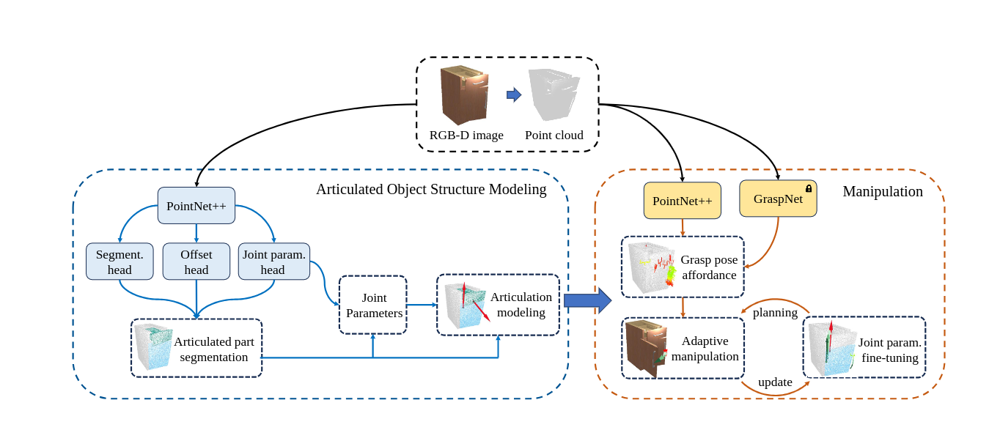

# GAMMA: Generalizable Articulation Modeling and Manipulation for Articulated Objects

## Overview 
This repository contains the implementation of the paper *[GAMMA: Generalizable Articulation Modeling and Manipulation for Articulated Objects](https://arxiv.org/abs/2309.16264)*
<p align="center"></p>


## About this repository
    checkpoint/                # contains checkpoint for the model
    datasets/                  # contains  dataloader code for the project
    example_data/              # contains example data for the project
    visual_model/              # contains code for the model
     

## 1. Install dependencies
### python 3.6
```bash
conda env create -f conda_env.yml
pip install -r packages.txt
```
The backbone depends on PointNet++.

    git clone --recursive https://github.com/erikwijmans/Pointnet2_PyTorch
    cd Pointnet2_PyTorch
    # [IMPORTANT] comment these two lines of code:
    #   https://github.com/erikwijmans/Pointnet2_PyTorch/blob/master/pointnet2_ops_lib/pointnet2_ops/_ext-src/src/sampling_gpu.cu#L100-L101
    pip install -r requirements.txt
    pip install -e .


## 2. Train the model
```bash
 python train_model.py --batch_size 16 --train_data_path=<PATH_CONFIG_OPTION>  --test_data_path=<PATH_CONFIG_OPTION> 
```

## 3. Evaluation the model

```bash
  python train_model.py  --train 0  --batch_size 1 --test_data_path=<PATH_CONFIG_OPTION> 
```

## 4. Inference and Visualization

```bash
 python inference_demo.py
```

## Citing

If you find this code useful in your work, please consider citing:
```
@article{yu2024gamma,
  title={GAMMA: Generalizable Articulation Modeling and Manipulation for Articulated Objects},
  author={Yu, Qiaojun and Wang, Junbo and Liu, Wenhai and Hao, Ce and Liu, Liu and Shao, Lin and Wang, Weiming and Lu, Cewu},
  booktitle={2024 International Conference on Robotics and Automation (ICRA)},
  year={2024},
  organization={IEEE},
}
```

